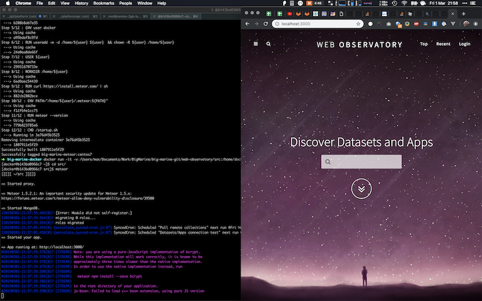

# Web Observatory Development Guide by Max

Updated instructions from 1 March 2019, created on macOS Mojave 10.14.3. To get started, checkout `big-marine-dev` branch:
                                                                                         
    git checkout -b big-marine-dev origin/big-marine-dev

## Using Docker

Create development docker image **big-marine-meteor:dev**:

    cd docker
    docker build -t big-marine-meteor:dev .     

Change into src folder, create a docker container with that image, and run `bash` in that container (expect a ton of warnings, it's an out of date node app after all!):

    cd ../src
    docker run -it -v "$PWD":/home/docker/src -p 3000:3000 big-marine-meteor:dev bash
    
Then:

    cd src
    meteor npm install
    meteor
    
You should see WebObservatory on http://locahost:3000

## OLD DOCS:

# Web Observatory Deployment Guide

Meteor apps can be deployed using [mupx](https://github.com/arunoda/meteor-up/tree/mupx). The guide below shows how to deploy web observatory manually.

First install Nginx, MongoDB and Nodejs. Currently Meteor (1.4.5) works with Node v4.4.x and MongoDB v3.2.

## Nginx settings

An annotated configuration file `wo` and SSL certificate `wo.pem` and key `wo.key` can be found under `nginx`. Please refer to the configuration file for more details. Set `ROOT_URL` to the public URL of your host.

On Ubuntu copy `wo` to `/etc/nginx/sites-available` and create a soft link in `/etc/nginx/sites-enabled`. Check whether the configuration is valid using `nginx -t`.

    sudo cp nginx/wo /etc/nginx/sites-available
    sudo ln -s /etc/nginx/sites-available/wo /etc/nginx/sites-enabled/wo
    sudo nginx -t

Then copy SSL cert/key files to `/etc/nginx/ssl`

    sudo cp nginx/wo.* /etc/nginx/ssl

## Meteor settings

Meteor settings are available in a Upstart script `wo.conf`. For security the script is run under a normal user `wo`. To make it work you need to add the user `wo` first.

    sudo adduser --disabled-login wo

Then copy the upstart script to `/etc/init`

    sudo cp wo.conf /etc/init

If you're on Ubuntu 15.04 or later, which uses systemd instead of Upstart, copy the following files instead of `wo.conf`.

    sudo cp wo.service /etc/systemd/system
    sudo cp launch-wo.sh /home/wo
    sudo chmod 755 /home/wo/launch-wo.sh
    sudo systemctl enable wo

In the settings given by `METEOR_SETTINGS`, if `public.environment` is dev, then some fake data will be loaded to the MongoDB database.

## Start WO

Extract `build/wo.tar.gz` to `/home/wo` and then start WO following `/home/wo/bundle/README`. Note that the same settings of wo.conf should be used.

    sudo cp build/linux_64/wo.tar.gz /home/wo
    (cd /home/wo && sudo tar -zxf wo.tar.gz && cd bundle/programs/server && sudo npm install)
    
Start WO either by executing 
    
    sudo start wo

if you're using Upstart, or

    sudo systemctl start wo

if you're using systemd.

## Upgrade from Previous WO

### Export data from a previous WO

Edit `migrate/export/config.js` and set `from` to the source MongoDB address. Then do

    cd migrate
    npm install
    node migrate.js

Exported data can be found at `import/private`.

### Import

At `migrate/import`, set `MONGO_URL` to the MongoDB address, and run the meteor app.

    export MONGO_URL=mongodb://localhost:27017/wo
    meteor reset
    meteor

After this you can start your WO normally.
